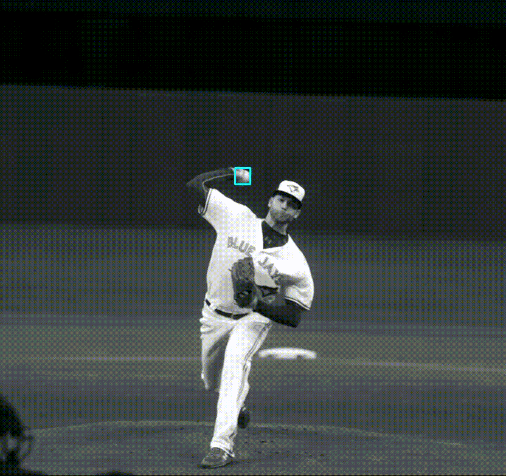

# Baseball tracking during pitching ⚾️🐦

### Step 1: Baseball detection

The bounding box for the baseball is determined using a pre-trained YOLOv3 network (MS COCO dataset has a class for sports ball).
YOLOv3 is used because it is a small network that achieves good performance for detection.
The architecture is well-known and has many implementations and pre-trained networks available ([example](https://github.com/cfotache/pytorch_objectdetecttrack)).
Faster-RCNN could also be used, with potentially better results, as it works better for small objects.
However, it would likely have slower inference time.

A deep learning approach was selected because it achieves better performance than classical image processing techinques. It is also more likely to work from a variety of view points and illuminations, due to the wide variety of training samples in the dataset. Further improvements to the detection method could be done with a larger, more accurate detection network, which would also increase training and inference time. 

As seen in the demo video, the network does not perform well when the ball passes in front of the pitcher's leg. This is likely because there is not much contrast between the white ball and the white pants.

To run the detections script:

```
cd config/
./download_weights.sh
cd ..
python get_detections.py -i <path to input video> --save-video
```

This generates a csv file of detections and an output video of the overlayed bounding boxes.

If the detections are generated on the CPU the inference time can be quite long.

### Step 2: Baseball tracking and release point

Assume for tracking that there is only one baseball in the video and that this baseball is being used for the pitch.
Define the release point as the instant the bounding box of the baseball is above the player's bounding box.



The ball is missed in some detections. These are interpolated quadratically before the release point and linearly after the release point. These methods were selected based on qualitative results.

To run the tracking script:

```
python get_tracks.py -i <path to input video> --input-csv <path to detections csv> -o <path to output csv>
```

This generates a csv file of ball tracks with a column for the ball release point.
It also produces a video with the bounding boxes of the ball, coloured pink if it is before the release point and yellow if it is after the release point.

### Step 3: Spin rate and spin axis

[Ijiri *et al.*](http://www.sic.shibaura-it.ac.jp/~ijiri/files/ijiri_spinEstimation_SIVP2017.pdf) propose a method for calculating the spin rate and spin direction of pitched baseballs independently.

The spin rate is defined in terms of the spin period. This is the time it takes for the ball, as it is rotating, to return to a similar appearance as a previous time step. The spin rate would be the reciprocal of this spin period.

The spin axis is calculated by performing texture registration. A frame of the ball is warped to a frame of a ball in a later frame, using orthagonal projection and 3D rotation.

This work uses a weighting function to remove the effects of illumination on the ball.
