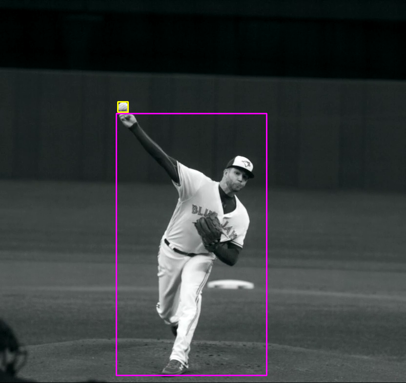

# Baseball tracking during pitching ⚾️🐦

**Step 1:** Baseball detection

The bounding box for the baseball is determined using a pre-trained YOLOv3 network (MS COCO dataset has a class for sports ball).
YOLOv3 is used because it is a small network that achieves good performance for detection.
The architecture is well-known and has many implementations and pre-trained networks available ([Example](https://github.com/cfotache/pytorch_objectdetecttrack)).
Faster-RCNN could also be used, with potentially better results, as it works better for small objects.
However, it would likely have slower inference time.

To run the detections script:

```
python get_detections.py
```

This generates a csv file of detections and an output video of the overlayed bounding boxes.

**Step 2:** Baseball tracking and release point

Assume for tracking that there is only one baseball in the video and that this baseball is being used for the pitch.
Define the release point as the instant the bounding box of the baseball is above the player's bounding box.



The ball is missed in some detections. These are interpolated quadratically before the release point and linearly after the release point. These methods were selected based on qualitative results.

**Step 3:** Spin rate and spin axis

